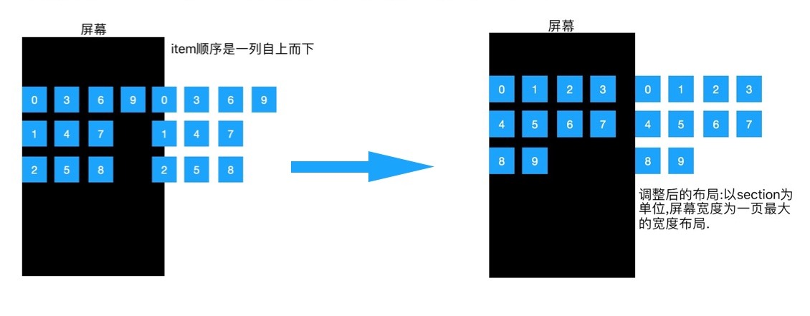
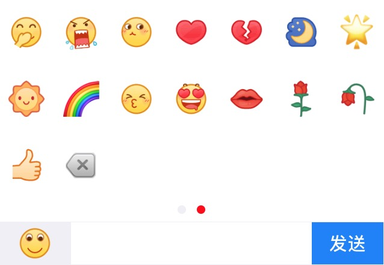
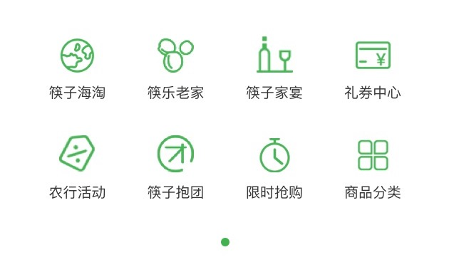

<h4>将系统FlowLayout布局形式调整为右图形式</h4>

<h4>适用场景:</h4>
<table style="text-align: center">
    <tr>
        <td>自定义表情键盘</td>
        <td>左右滑动的菜单项</td>
    </tr>
    <tr>
        <td></td>
        <td></td>
    </tr>
</table>
<h4>你可通过设置以下属性来达到预期效果:</h4>

```objective-c  

///Mark: 内容的偏移量(包括区头的左右)
@property (nonatomic, assign) UIEdgeInsets contentInset;

///Mark: 以下属性可通过UICollectionViewDelegateFlowLayout协议方法对每个section单独设置
///Mark: section的偏移量,通过这个属性设置统一的偏移
@property (nonatomic, assign) UIEdgeInsets sectionInset;

@property (nonatomic, assign) CGFloat minimumLineSpacing;
@property (nonatomic, assign) CGFloat minimumInteritemSpacing;

@property (nonatomic, assign) CGSize itemSize;

@property (nonatomic, assign) CGSize headerReferenceSize;
@property (nonatomic, assign) CGSize footerReferenceSize;  

```
